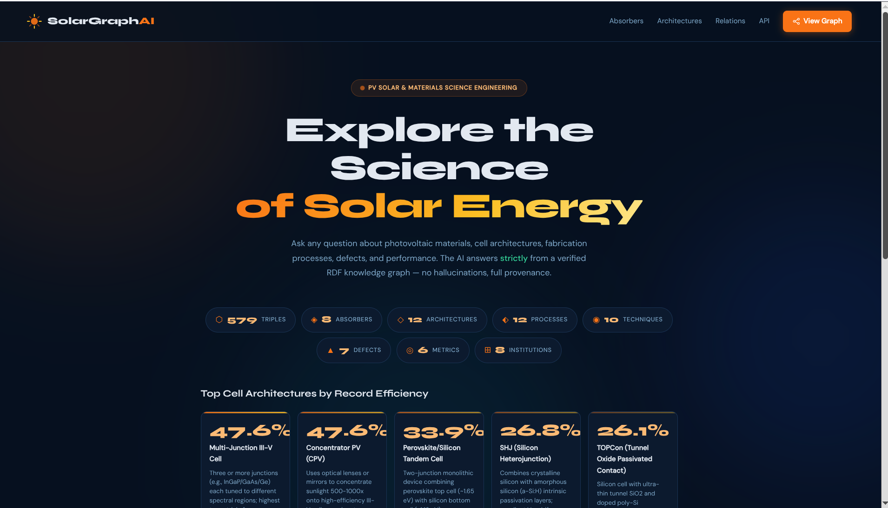
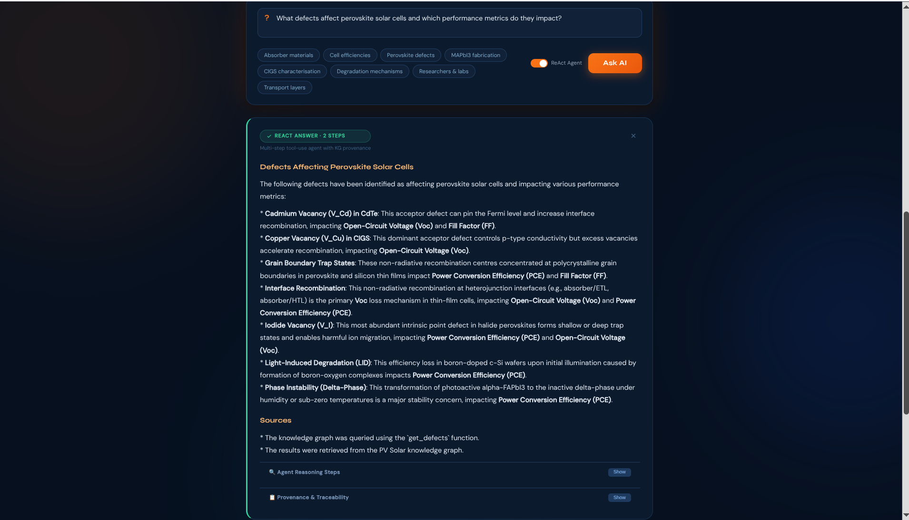
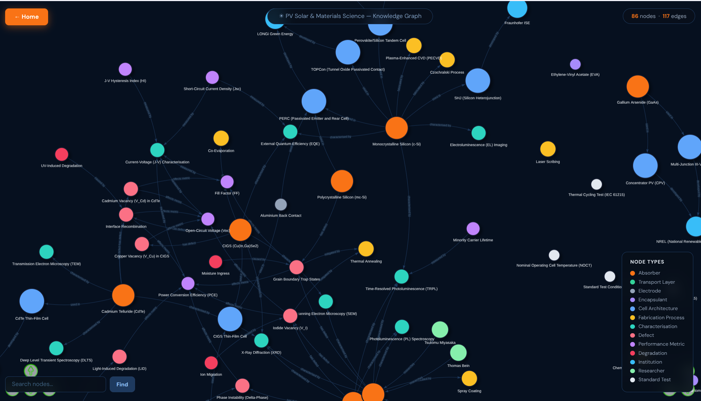

# SolarGraph AI
### LLM Agent & Knowledge Graph for Photovoltaic Materials Science

[](https://python.org)
[](https://rdflib.readthedocs.io)
[](LICENSE)
[](https://huggingface.co/spaces/sparklehug/solargraph-ai)





A research prototype demonstrating **grounded LLM agents** over a formal **RDF/OWL knowledge graph** for photovoltaic (PV) solar energy and materials science. Every answer is traceable to specific SPARQL-retrieved triples with no hallucinations and full provenance.

---

## Abstract

SolarGraph AI combines a hand-crafted OWL ontology, a SPARQL query engine, and a multi-step ReAct agent to answer domain questions about PV materials. The system is designed around three core principles from the materials informatics literature:

1. **Grounding**: the LLM is constitutionally constrained to KG-retrieved facts only
2. **Tool use**: a ReAct loop lets the agent iteratively run SPARQL queries and reflect on results before answering
3. **Provenance**: every answer records the cited entities, supporting triples, and SPARQL queries that produced it

This directly mirrors the workflow described in emerging materials science LLM agent systems, where structured knowledge retrieval replaces unstructured vector search to enable reproducible, auditable answers.

---

## System Architecture

```
User Question (natural language)
        │
        ▼
┌───────────────────────────────────┐
│     ReAct Agent (Groq LLM)        │
│                                   │
│  while not done:                  │
│    Thought -> select tool          │
│    Action  -> call SPARQL tool     │
│    Observation -> inspect results  │
│  Final Answer + Provenance Record │
└──────────────┬────────────────────┘
               │  SPARQL (RDFLib)
               ▼
┌───────────────────────────────────┐
│ PV Solar Semantic Knowledge Graph │
│ ontology.ttl  — OWL TBox          │
│ data.ttl      — RDF ABox + PROV-O │
│ shapes.ttl    — SHACL validation  │
│ PMDco alignment + QUDT units      │
└───────────────────────────────────┘
```

**Also included:** a fast single-shot agent with dual-layer caching (LRU + JSON file) for low-latency repeated queries.

---

## Knowledge Graph Coverage

| OWL Class | # Individuals | Key Examples |
|---|---|---|
| Absorber | 8 | c-Si (1.12 eV), MAPbI₃ (1.55 eV), FAPbI₃ (1.48 eV), CIGS (1.15 eV), CdTe (1.44 eV) |
| CellArchitecture | 12 | PERC 24.5%, TOPCon 26.1%, SHJ 26.8%, Perovskite/Si Tandem 33.9% |
| FabricationProcess | 12 | Czochralski, PECVD, Spin Coating, Slot-Die, Co-Evaporation |
| CharacterisationTechnique | 10 | J-V, EQE, TRPL, XRD, SEM, TEM, DLTS, PL, EL |
| Defect | 7 | Iodide Vacancy, Grain Boundary Traps, Phase Separation (α→δ FAPbI₃) |
| PerformanceMetric | 6 | PCE, Voc, Jsc, FF, Carrier Lifetime, Hysteresis Index |
| DegradationMechanism | 5 | Moisture Ingress, Thermal Degradation, Ion Migration, PID |
| Institution | 8 | NREL, Fraunhofer ISE, HZB, KAUST, EPFL, Oxford PV |
| Researcher | 5 | Grätzel, Snaith, Miyasaka, Sargent, Bein |

---

## Features

| Feature | Implementation |
|---|---|
| **OWL ontology** | Versioned TBox at `https://w3id.org/pvsolar`, with PMDco mappings and disjointness axioms |
| **QUDT units** | Unit-neutral property names annotated with QUDT quantity kinds and unit IRIs |
| **SHACL validation** | Labels, numeric ranges, unit annotations, and statement provenance checked at build time |
| **SPARQL engine** | 15+ domain-specific query methods via RDFLib |
| **Fast agent** | Single-shot RAG: SPARQL context -> Groq LLM -> answer |
| **ReAct agent** | Multi-step tool-use loop with up to 6 iterations |
| **Provenance** | PROV-O-backed RDF statements for every domain literal plus answer-level audit trails |
| **Dual-layer cache** | `functools.lru_cache` (in-process) + JSON file (24h TTL) |
| **Graph visualiser** | Self-contained vis.js CDN network - no 404s |
| **REST API** | `/api/entities`, `/api/absorbers`, `/api/architectures`, `/api/search` |
| **Gradio UI** | HuggingFace Spaces-compatible interface |

---

## Ontology Sample

```turtle
@prefix pv: <https://w3id.org/pvsolar#> .
@prefix pmd: <https://w3id.org/pmd/co/> .
@prefix qudt: <http://qudt.org/schema/qudt/> .
@prefix unit: <http://qudt.org/vocab/unit/> .
@prefix quantitykind: <http://qudt.org/vocab/quantitykind/> .

# TBox: PMDco alignment and a unit-neutral QUDT property
pv:Material rdfs:subClassOf pmd:PMD_0000000 .
pv:bandgap a owl:DatatypeProperty ;
    qudt:hasQuantityKind quantitykind:EnergyLevel ;
    qudt:hasUnit unit:EV .

# ABox: standard labels and values; data.ttl also reifies each literal with PROV-O
pv:MAPbI3 a pv:Absorber ;
    rdfs:label "Methylammonium Lead Iodide (MAPbI3)"@en ;
    skos:prefLabel "Methylammonium Lead Iodide (MAPbI3)"@en ;
    pv:bandgap "1.55"^^xsd:decimal ;
    pv:hasDefect pv:IodideVacancy, pv:GrainBoundaryTrap .
```

---

## Installation

**Prerequisites:** Python 3.10+ · Free [Groq API key](https://console.groq.com)

```bash
git clone https://github.com/YOUR_USERNAME/solargraph-ai.git
cd solargraph-ai

python -m venv .venv && source .venv/bin/activate
pip install -r requirements.txt

cp .env.example .env        # add GROQ_API_KEY; OPENALEX_API_KEY is optional
python build_graph.py       # loads TBox + ABox, validates SHACL, writes graph.pkl
python app.py               # → http://127.0.0.1:5000
```

> `load_graph()` automatically rebuilds stale `graph.pkl` files when `ontology.ttl`, `data.ttl`, optional `ingested_data.ttl`, or `shapes.ttl` changes. Clear answer caches after semantic changes.

---

## Deploying to HuggingFace Spaces

```bash
# 1. Create a new Space at huggingface.co/new-space
#    SDK: Gradio  |  Visibility: Public

# 2. Push your files
git remote add hf https://huggingface.co/spaces/YOUR_USERNAME/solargraph-ai
git push hf main

# 3. Add your API key
#    Space Settings -> Secrets -> New Secret
#    Name: GROQ_API_KEY   Value: <your key>

# HuggingFace will auto-detect hf_app.py and launch it
```

---

## API Reference

| Method | Endpoint | Description |
|---|---|---|
| `POST` | `/ask` | Fast grounded answer (cached) |
| `POST` | `/ask/react` | ReAct agent answer + provenance |
| `GET` | `/graph` | Interactive vis.js knowledge graph |
| `GET` | `/api/stats` | Triple + entity counts |
| `GET` | `/api/entities?type=Absorber` | Entities by OWL class |
| `GET` | `/api/absorbers` | Absorbers with bandgap data |
| `GET` | `/api/architectures` | Cell architectures by efficiency |
| `GET` | `/api/search?q=perovskite` | Full-text search |
| `GET` | `/api/cache/stats` | Hit/miss statistics |
| `POST` | `/api/cache/clear` | Invalidate all caches |

---

## Roadmap

- [x] OpenAlex literature ingestion pipeline (LLM entity extraction -> graph)
- [ ] W3C SPARQL 1.1 endpoint via SPARQLWrapper
- [x] Core ontology alignment with PMDco and QUDT
- [ ] DFT/MD simulation data as typed RDF literals
- [ ] LangGraph-based workflow orchestration
- [ ] Evaluation benchmark: answer accuracy vs. ground-truth triples

---

## Relevance to Materials Informatics

This project prototype implements the core techniques now appearing in materials science LLM research:

- **Semantic data modelling** - OWL/RDF encodes expert domain knowledge as machine-readable facts
- **Structured RAG** - SPARQL retrieval replaces unstructured vector search for reproducibility
- **Agentic tool use** - ReAct loop demonstrates agent control beyond single-prompt engineering
- **Provenance/traceability** - every answer is auditable back to specific KG triples
- **Heterogeneous data integration** - architecture supports connecting to simulation databases, literature, and experimental repositories

Applicable to: NOMAD, Materials Project, OPTIMADE, AFLOW, and emerging perovskite/battery knowledge graph initiatives.

---

## Tech Stack

| Layer | Technology |
|---|---|
| Ontology | OWL 2 / Turtle RDF, PMDco 3.1.1, QUDT, PROV-O, SHACL |
| Graph engine | RDFLib 7 + SPARQL 1.1 |
| LLM provider | Groq API (llama3-70b-8192) |
| Agent framework | Custom ReAct loop |
| Web framework | Flask 3 |
| UI: web | Jinja2 + vanilla JS + vis.js |
| UI: HuggingFace | Gradio 4 |
| Caching | `lru_cache` + JSON file |

---

## License

MIT - see [LICENSE](LICENSE)

---

## Citation

```bibtex
@software{solargraph_ai_2026,
  title  = {SolarGraph AI: LLM Agent and Knowledge Graph for PV Materials Science},
  author = {Whyte Goodfriend},
  year   = {2026},
  url    = {https://github.com/marblehub/solargraph-ai}
}
```
